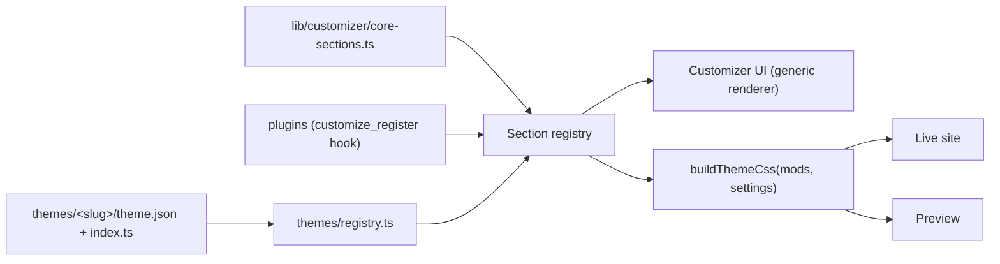

# Theme Customizer: Analysis & Refactor Proposal

## 1. What's wrong now

### `customizer-shell.tsx`: 2,685 lines / 131 KB in a single component
It does at least 8 different jobs:

| Concern | Where | Problem |
|---|---|---|
| Color palettes (7 × ~40 keys) | L181-412 | Declared **inside** the component body, so they're rebuilt on every render |
| Font catalogs | L415-431 | Duplicates the `switch` in `getFontFamilyCss` and the union types in `ThemeMods` |
| 9 accordion sections | L855-2231 | Every section copy-pastes the same header button markup |
| ~60 hand-written controls | throughout | Each one is `<ColorField value={mods.x} defaultValue="#..." onChange={v => updateMods({x: v})}/>` |
| CSS variable generation | L2253-2321 | **Copy of** `ThemeDynamicStyles`, and the two have drifted apart |
| Fake preview content | L471-681, L2328-2675 | Hard-coded mock article and sidebar. Doesn't use the real widgets or templates |
| `preview*` fallback vars | L440-455 | A third copy of the fallback logic |
| State, publish, toolbar | L107-178, L692-841 | Fine, but buried under everything else |

### `lib/themes/types.ts`: one flat bag for every theme
- `ThemeMods` has ~70 optional keys shared by **all** themes. A theme can't declare its own settings or hide ones it doesn't support.
- `DEFAULT_MODS` repeats ~70 keys for each of 5 themes. `pressforge-deep-tech` is a straight copy of broadsheet and **isn't registered** in `AVAILABLE_THEMES`, so nothing uses it.
- The legacy aliases mutate the exported object (L431-435). The same alias map also exists in [loader.ts](file:///e:/DevOps/wp-clone/news/lib/themes/loader.ts#L67-L70).
- There's an `import` in the middle of the file (L118). `headingFont` is a legacy duplicate of `headingFontFamily`.

### Theme identity is spread across 5+ places
- **Metadata:** [loader.ts](file:///e:/DevOps/wp-clone/news/lib/themes/loader.ts)
- **Defaults:** [types.ts](file:///e:/DevOps/wp-clone/news/lib/themes/types.ts)
- **Palettes:** the shell
- **Behaviour by slug sniffing:** `themeSlug.includes("midnight")` in [site-theme.ts](file:///e:/DevOps/wp-clone/news/lib/site-theme.ts#L134-L141), plus `site-header.tsx`, `section-header.tsx`, `news-home.tsx` and `post-template.tsx`

Compare plugins and widgets, which already follow `folder/manifest.json + index.ts → registry.ts`.

### Bugs this structure causes

> [!WARNING]
> I found these by reading the code. They are not confirmed at runtime.

1. **Palettes leak into each other.** "Financial Amber", "Editorial Stone", "Oxford Navy" and "Violet Tech" only set about 20 keys. `updateMods` merges, so if you pick Crimson and then Amber, Crimson's widget, badge, dropdown and sub-footer colors stay behind.
2. **Defaults have 4 sources of truth that disagree:**
   - `navBarBg`: control default `#0f172a`, CSS fallback `surface`, broadsheet default `#ffffff`
   - `topBarTextColor`: `#ffffff` in the preview, `#f8fafc` on the live site
   - `headerTextColor`: control default `#020617`, theme default `#0f172a`
3. **The preview doesn't match the live site.** The preview CSS is missing `--font-theme-heading/body` and `--theme-footer-widget-bg`, and it skips the footer-widget rules.
4. **Switching themes ignores saved settings.** `handleSwitchTheme` resets to `DEFAULT_MODS` instead of loading that theme's saved mods. Also, `useState(initialData.mods)` won't pick up new `initialData` after `router.push` unless the component is keyed.
5. **Footer colors appear twice** (Colors section and Footer section) with different labels.
6. **`customCss` goes raw into `<style dangerouslySetInnerHTML>`.** That's OK for admin-only use, but you should still strip `</style` to stop tag breakout.
7. **Translations are mixed.** Some labels use `dict?.[…] || "..."`, others are plain English (e.g. "Site Title", all the footer labels).

## 2. Why it ended up like this
This is a typical result of building something one prompt at a time:
- Each request ("add more colors", "add footer options", "add single-post preview") was added to the file already open. The AI agent edits locally and doesn't step back to restructure.
- There was no **schema**, so each new setting needed edits in 4 places: type, defaults, control JSX and CSS var. Copy-paste was the easiest way to do that.
- The AI agent wanted the preview to "look real" right away, so it inlined mock HTML instead of reusing the real templates.
- Nobody pointed it at the plugin/widget pattern, so it never reused it.

## 3. Target architecture: schema-driven, like plugins and widgets

Core idea: **each setting is declared once.** Its type, default, control, CSS variable and fallback all come from that one declaration.



### Core types (`lib/customizer/types.ts`)
```ts
export type ControlType =
  | "color" | "toggle" | "select" | "radio-cards"
  | "range" | "text" | "textarea" | "code" | "image";

export interface SettingDef {
  id: string;                 // key in mods, e.g. "navBarBg"
  type: ControlType;
  label: string;
  labelKey?: string;          // i18n key
  description?: string;
  default?: unknown;
  options?: { value: string; label: string; note?: string }[];
  min?: number; max?: number; step?: number; unit?: string;
  cssVar?: string;            // "--theme-nav-bg"
  fallback?: string;          // another setting id: "surfaceColor"
  showIf?: (mods: Mods) => boolean;
}

export interface CustomizerSection {
  id: string;
  title: string;
  titleKey?: string;
  icon?: string;              // lucide icon name
  priority: number;
  groups: { id: string; title?: string; settings: SettingDef[] }[];
}
```

### Theme module (mirrors `PluginModule` and `WidgetModule`)
```ts
export interface ThemeModule {
  manifest: ThemeManifest;            // from theme.json
  defaults: Partial<Mods>;            // only what differs from core defaults
  palettes?: Palette[];               // full palettes, applied over a reset base
  supports?: {                        // replaces slug sniffing
    darkMode?: boolean;
    headerLayouts?: HeaderLayout[];
    singleLayouts?: SingleLayout[];
  };
  sections?: CustomizerSection[];     // theme-specific extra settings
  hiddenSettings?: string[];          // hide core settings this theme doesn't support
}
```

### Folder layout
```
lib/customizer/
  types.ts
  core-sections/          identity.ts, colors.ts, typography.ts, header.ts, ...
  registry.ts             getSections(themeSlug) = core + theme + plugin hooks
  css.ts                  buildThemeCss(mods, settings): the ONLY CSS generator
  resolve.ts              resolveMods(theme, stored): defaults → theme → stored
  fonts.ts                one font catalog (ids, labels, CSS stacks, Google URL)

themes/
  registry.ts
  pressforge-broadsheet/  theme.json, index.ts
  pressforge-magazine/    ...
  pressforge-midnight/
  pressforge-longform/

app/(admin)/admincp/customize/_components/
  customizer-shell.tsx    ~150 lines: layout + wiring
  use-customizer.ts       state, dirty tracking, publish, reset
  toolbar.tsx
  section-panel.tsx       generic accordion → renders groups → controls
  controls/               color.tsx, toggle.tsx, select.tsx, range.tsx, ...
    index.ts              CONTROL_REGISTRY: Record<ControlType, Component>
  preview/
    preview-frame.tsx     renders real SiteHeader/NewsHome/PostTemplate
    mock-data.ts
```

### What a section looks like afterwards
```ts
// lib/customizer/core-sections/colors.ts
export const colorsSection: CustomizerSection = {
  id: "colors", title: "Color Palette & Scheme", icon: "Palette", priority: 20,
  groups: [
    { id: "nav", title: "Navigation Menu Colors", settings: [
      { id: "navBarBg",        type: "color", label: "Nav Menu Background", cssVar: "--theme-nav-bg",         fallback: "surfaceColor" },
      { id: "navLinkColor",    type: "color", label: "Nav Links Text",      cssVar: "--theme-nav-link",       fallback: "headingColor" },
      { id: "navLinkHoverColor", type: "color", label: "Nav Links Hover",   cssVar: "--theme-nav-link-hover", fallback: "primaryColor" },
    ]},
    // ...
  ],
};
```
About 1,200 lines of JSX in the colors section become about 80 lines of data. `buildThemeCss` walks the settings and outputs `--theme-nav-bg: <value or resolved fallback>`, so the preview and the live site **can't drift** again.

### Plugin extensibility (WordPress `customize_register`)
Plugins already have `hooks.ts`. Add a filter:
```ts
addFilter("customizer_sections", (sections) => [...sections, breakingNewsSection]);
```
The breaking-news plugin then owns its ticker colors and text instead of them living in core `ThemeMods`.

### Preview strategy
- **Short term:** render the real `SiteHeader`, `NewsHome`, `PostTemplate` and widget areas with mock posts, using the `buildThemeCss` output scoped to the preview container.
- **Long term (WordPress approach):** an `<iframe src="/?customize_preview=1">` that receives mods through `postMessage`. This gives full CSS isolation, so the preview CSS won't leak into the admin `:root`.

## 4. Migration plan (each phase ships on its own)

| Phase | Work | Risk |
|---|---|---|
| **1. Single source of CSS** | Create `lib/customizer/css.ts` and `fonts.ts`. Use them in both `ThemeDynamicStyles` and the preview. Delete the duplicate block. | Low |
| **2. Control components** | Split `ColorField`, toggles, selects and so on into `controls/`. Pull out `use-customizer.ts` and `toolbar.tsx`. | Low |
| **3. Schema** | Move sections into `core-sections/*.ts`. Build the generic `section-panel.tsx`. | Medium |
| **4. Theme modules** | Create `themes/<slug>/` with `theme.json` + `index.ts` and a registry. Move defaults and palettes. Replace slug sniffing with `supports`. Drop the dead `deep-tech` entry. Centralise legacy aliases. | Medium |
| **5. Plugin hook** | Add the `customizer_sections` filter. Move breaking-news ticker settings into its plugin. | Low |
| **6. Real preview** | Reuse the real templates (or the iframe approach). Delete the mock JSX. | Medium |

`ThemeMods` keys and the stored `theme_mods_<slug>` JSON **don't change**, so no data migration is needed.


Not done

Breaking-news ticker settings: I added the customizer_sections plugin filter, but left the ticker settings in core. The header renders the ticker whether or not the plugin is active, and plugins are only initialised on post pages, so plugin-owned settings wouldn't reach the live site.
Preview is not an iframe: the iframe approach from the guide's "long term" section isn't done. Responsive breakpoints in the preview still follow the browser window, not the tablet/mobile toggle.
New labels: they use English fallbacks until the admin dictionary gets keys for them.